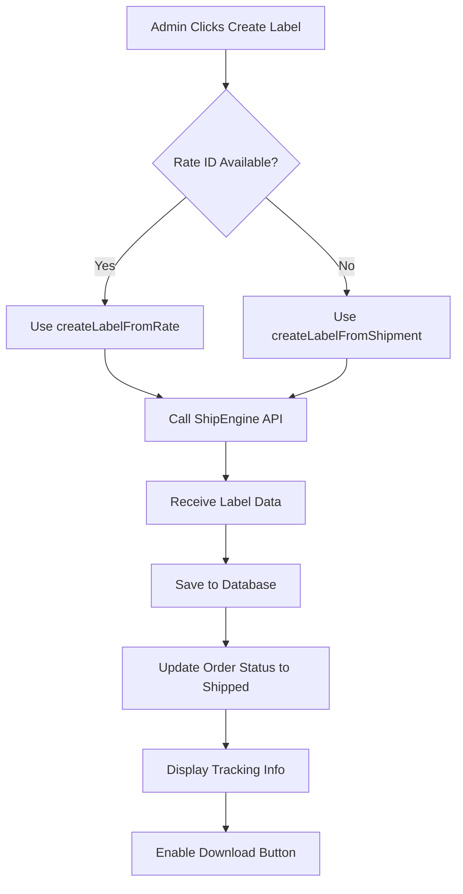

# 📦 Shipping Label Creation Integration Guide

## ✅ Complete Implementation Summary

Your **Mayhem Creations** admin panel now has integrated **ShipEngine label creation** functionality! Admin users can create shipping labels directly from the orders page after payment is confirmed.

---

## 🎯 Where to Find It

### **Location: Admin Orders Section**

Navigate to: **Admin Panel → Pending Review (Orders)**

---

## 🔧 Setup Requirements

### **1. Database Migration**

Run this SQL migration to add label fields:

```powershell
cd backend
psql -U your_user -d your_database -f src/scripts/add-label-fields.sql
```

Or use the PowerShell script:

```powershell
cd backend/src/scripts
./run-migration.ps1
```

### **2. Environment Variables**

Add to your `backend/.env`:

```env
# ShipEngine Configuration
SHIPENGINE_API_KEY=test_your_api_key_here
SHIPENGINE_CARRIER_ID=se-123456
```

**Get your API key from:** [ShipEngine Dashboard](https://www.shipengine.com/)

### **3. Install Dependencies**

```powershell
cd backend
npm install axios
```

---

## 📸 Visual Guide: How to Use

### **Step 1: View Order Details**

1. Go to **Admin → Pending Review**
2. Click **"View Details"** on any approved order


### **Step 2: Create Label**

Once order is approved, you'll see:

**🟢 "Create Label" Button** (Green button with printer icon)

- **Shows when:** Order is approved/ready to ship
- **Hidden when:** Label already created
- **Click to:** Generate shipping label via ShipEngine


### **Step 3: Label Created Successfully**

After clicking, you'll see:

✅ **Success Message:**
```
Label created successfully!
Tracking: 1Z999AA10123456784
```

✅ **Tracking Information Card** appears in order details:
- **Tracking Number** (large, monospace font)
- **Carrier** (USPS, UPS, FedEx, etc.)
- **Service** (Priority Mail, Ground, etc.)
- **Download Label Button** (PDF download)


### **Step 4: Download & Print**

**Purple "Download Label" Button** 
- Opens label PDF in new tab
- Print this label and attach to package
- Use tracking number for updates


---

## 🔄 Complete Workflow

```
1. Customer completes payment
   ↓
2. Order appears in "Pending Review" (status: approved)
   ↓
3. Admin clicks "View Details" button
   ↓
4. Admin clicks green "Create Label" button
   ↓
5. System calls ShipEngine API
   ↓
6. Label generated with tracking number
   ↓
7. Order status updated to "Shipped"
   ↓
8. Tracking info displayed in order details
   ↓
9. Admin clicks "Download Label (PDF)"
   ↓
10. Admin prints label and ships package
   ↓
11. Customer receives tracking email (future feature)
```

---

## 🎨 Button States & Colors

| Button | Color | Icon | When Shown | Action |
|--------|-------|------|------------|--------|
| **Create Label** | Green (#10B981) | Printer | Order approved, no tracking | Creates label |
| **Creating...** | Green (disabled) | Printer | During API call | Loading state |
| **Download Label** | Purple (#9333EA) | Download | Label exists | Opens PDF |
| **Update Status** | Blue (#2563EB) | - | Always | Status modal |

---

## 🏷️ Custom Label Messages

Your labels automatically include:

### **Reference Line 1:** Order Number
```
MC-1234
```

### **Reference Line 2:** Item Type
```
2 Embroidered Items
```
or
```
3 Standard Items
```

### **Reference Line 3:** Customer Name
```
John Doe
```

These appear on the physical label based on carrier:
- **USPS:** Below barcode
- **UPS:** In "Reference" fields
- **FedEx:** In reference section

---

## 🔌 API Endpoints

### **Create Label**
```http
POST /api/v1/labels/create
Authorization: Bearer {token}
Content-Type: application/json

{
  "orderId": 123,
  "rateId": "rate_abc123" // Optional: faster if available
}
```

**Response:**
```json
{
  "success": true,
  "message": "Shipping label created successfully",
  "data": {
    "orderId": 123,
    "orderNumber": "MC-1234",
    "trackingNumber": "1Z999AA10123456784",
    "labelDownloadPdf": "https://api.shipengine.com/...",
    "carrierCode": "usps",
    "serviceCode": "usps_priority_mail",
    "shipmentCost": 12.50
  }
}
```

### **Get Label Info**
```http
GET /api/v1/labels/order/123
Authorization: Bearer {token}
```

### **List All Labels**
```http
GET /api/v1/labels/all?limit=50&offset=0
Authorization: Bearer {token}
```

---

## 🗄️ Database Schema

New fields added to `order_review` table:

| Column | Type | Description |
|--------|------|-------------|
| `shipping_label_url` | TEXT | PDF download URL |
| `carrier_code` | VARCHAR(50) | Carrier (usps, ups, fedex) |
| `service_code` | VARCHAR(100) | Service type (usps_priority_mail) |
| `tracking_number` | VARCHAR(100) | Tracking number (existing) |
| `shipped_at` | TIMESTAMP | When label was created |

---

## 🎯 UI Components Added

### **Frontend (`PendingReview.tsx`)**

1. **State Variables:**
   - `creatingLabel`: Loading state
   - `labelData`: Stores label response
   - `isLabelModalOpen`: Modal visibility

2. **Functions:**
   - `handleCreateLabel()`: Creates label
   - `handleDownloadLabel()`: Opens PDF

3. **UI Elements:**
   - Create Label button (conditional)
   - Download Label button (conditional)
   - Tracking Information card (conditional)
   - Loading states

### **Backend**

1. **Service:** `shipEngineLabelService.ts`
   - `createLabelFromRate()`: Use existing rate
   - `createLabelFromShipment()`: Create from scratch
   - `generateLabelMessages()`: Custom messages
   - `calculateOrderWeight()`: Weight calculation
   - `saveLabelToOrder()`: Database update

2. **Controller:** `labelController.ts`
   - `createLabel()`: POST endpoint
   - `getLabelByOrderId()`: GET endpoint
   - `getAllLabels()`: List endpoint

3. **Routes:** `labelRoute.ts`
   - `/api/v1/labels/create`
   - `/api/v1/labels/order/:orderId`
   - `/api/v1/labels/all`

---

## 🧪 Testing

### **Test in Sandbox Mode**

1. Use test API key from ShipEngine
2. Create test order in admin panel
3. Click "Create Label"
4. Verify tracking number generated
5. Download and check PDF

### **Test Data**

```javascript
{
  "orderId": 1,
  "rateId": null // Will create from shipment details
}
```

---

## 🐛 Troubleshooting

### **Error: "SHIPENGINE_API_KEY not set"**
**Solution:** Add API key to `backend/.env`

### **Error: "Order not found"**
**Solution:** Verify order ID exists and is approved

### **Error: "Label already exists"**
**Solution:** Order already has tracking number. Use "Download Label" instead.

### **Error: "Shipping address not found"**
**Solution:** Ensure order has valid shipping address from checkout

### **Button not appearing**
**Check:**
- Order status is `approved`, `approved-processing`, or `ready-for-production`
- No existing `tracking_number` on order
- User has admin permissions

### **Label creation times out**
**Possible causes:**
- ShipEngine API slow/down
- Network issues
- Invalid shipment data

**Solution:** Check browser console and backend logs

---

## 📊 Label Creation Process



---

## 🚀 Future Enhancements

### **Phase 2: Automation**
- Auto-create labels after payment (configurable)
- Bulk label creation for multiple orders
- Print queue integration

### **Phase 3: Customer Features**
- Automatic tracking emails
- Real-time tracking updates
- Delivery notifications

### **Phase 4: Advanced**
- Return label generation
- Label voiding/cancellation
- Multi-package shipments
- International customs forms

---

## 📝 Code Examples

### **Frontend: Create Label Handler**

```typescript
const handleCreateLabel = async (orderId: number, rateId?: string) => {
  setCreatingLabel(true)
  
  const response = await fetch('/api/v1/labels/create', {
    method: 'POST',
    headers: {
      'Authorization': `Bearer ${token}`,
      'Content-Type': 'application/json'
    },
    body: JSON.stringify({ orderId, rateId })
  })
  
  const data = await response.json()
  
  if (data.success) {
    alert(`Label created! Tracking: ${data.data.trackingNumber}`)
    loadReviews() // Refresh
  }
  
  setCreatingLabel(false)
}
```

### **Backend: Label Service**

```typescript
async createLabelFromRate(rateId: string, orderId: number) {
  const response = await axios.post(
    `https://api.shipengine.com/v1/labels/rates/${rateId}`,
    {
      label_messages: {
        reference1: 'MC-1234',
        reference2: '2 Embroidered Items',
        reference3: 'John Doe'
      }
    },
    {
      headers: { 'API-Key': this.apiKey }
    }
  )
  
  return {
    trackingNumber: response.data.tracking_number,
    labelDownloadPdf: response.data.label_download.pdf
  }
}
```

---

## ✅ Integration Checklist

- [ ] Database migration run successfully
- [ ] ShipEngine API key added to `.env`
- [ ] Backend dependencies installed (`axios`)
- [ ] Backend server restarted
- [ ] Frontend compiled and deployed
- [ ] Test order created
- [ ] Label created successfully
- [ ] PDF downloaded and verified
- [ ] Tracking number displayed
- [ ] Order status updated to "Shipped"

---

## 📞 Support

**Documentation:** [ShipEngine API Docs](https://www.shipengine.com/docs/)

**API Status:** [ShipEngine Status](https://status.shipengine.com/)

**Rate Limits:** 
- Sandbox: 1000 requests/minute
- Production: Contact ShipEngine

---

## 🎉 Success Indicators

You'll know it's working when:

1. ✅ Green "Create Label" button appears in approved orders
2. ✅ Clicking button shows "Creating..." state
3. ✅ Success alert with tracking number appears
4. ✅ Tracking info card displays in order details
5. ✅ Purple "Download Label" button works
6. ✅ PDF opens in new tab with proper label
7. ✅ Order status changes to "Shipped"
8. ✅ Database shows tracking number and label URL

---

**🎊 Congratulations! Your label creation feature is fully integrated!**

Now admins can create shipping labels directly from the orders page with just one click!

