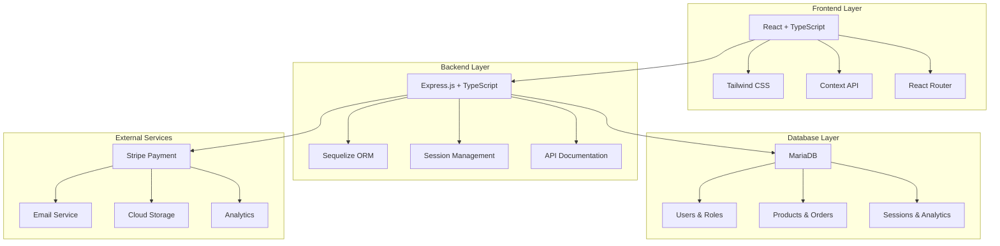
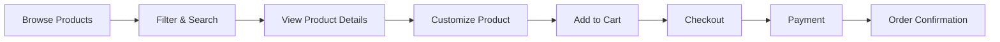
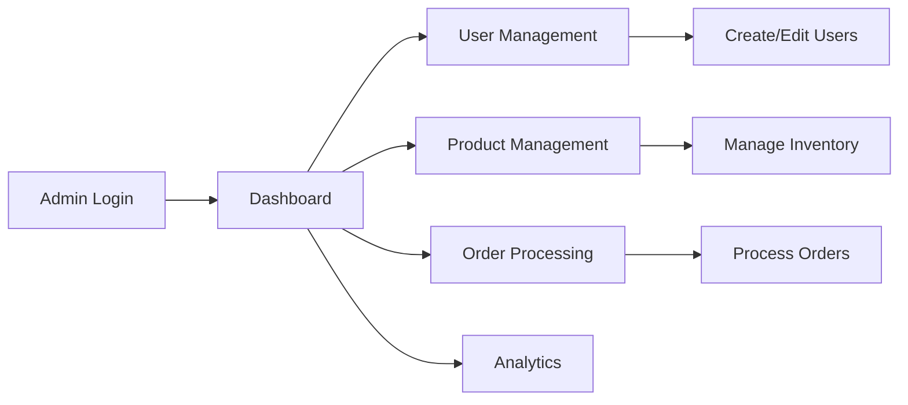

# 🎨 Mayhem Creations - Enterprise E-commerce Platform

<div align="center">


**A Full-Stack E-commerce Platform with Advanced Customization & Multi-Role Management**

[](https://www.typescriptlang.org/)
[](https://reactjs.org/)
[](https://expressjs.com/)
[](https://mariadb.org/)
[](https://tailwindcss.com/)

[](https://opensource.org/licenses/MIT)
[](http://makeapullrequest.com)
[](https://prettier.io/)

</div>

---

## 🌟 Overview

**Mayhem Creations** is a cutting-edge, enterprise-grade e-commerce platform that revolutionizes the custom merchandise industry. Built with modern web technologies and designed for scalability, it offers an unparalleled shopping experience with advanced product customization, multi-role management, and comprehensive business intelligence.

### 🎯 Key Highlights

- 🛍️ **Advanced E-commerce**: Complete shopping experience with customization
- 🎨 **Interactive Design Tool**: Drag-and-drop product customization
- 👥 **Multi-Role System**: Customer, Admin, Seller, and Employee interfaces
- 🔐 **Enterprise Security**: Session-based auth with RBAC and MFA
- 📊 **Business Intelligence**: Comprehensive analytics and reporting
- 🚀 **Performance Optimized**: Built for scale with modern architecture
- 📱 **Mobile-First**: Responsive design across all devices

---

## 🏗️ Architecture

<div align="center">



</div>

---

## ✨ Features

### 🛒 E-commerce Core

| Feature | Description | Status |
|---------|-------------|--------|
| 🛍️ **Product Catalog** | Advanced filtering, search, and categorization | ✅ Complete |
| 🎨 **Customization Engine** | Interactive design tool with real-time preview | ✅ Complete |
| 🛒 **Smart Cart** | Persistent cart with synchronization | ✅ Complete |
| 💳 **Checkout Flow** | Multi-step checkout with payment integration | ✅ Complete |
| 📦 **Order Management** | Complete order lifecycle management | ✅ Complete |
| 🔍 **Search & Filters** | Advanced search with faceted filtering | ✅ Complete |

### 🔐 Authentication & Security

| Feature | Description | Status |
|---------|-------------|--------|
| 🔑 **Multi-Factor Auth** | TOTP and SMS-based 2FA | ✅ Complete |
| 👥 **Role-Based Access** | Granular permissions system | ✅ Complete |
| 🛡️ **Session Security** | Database-backed sessions with rotation | ✅ Complete |
| 🔒 **Account Protection** | Brute force protection and lockout | ✅ Complete |
| 🌐 **OAuth Integration** | Google, Facebook, and Apple login | ✅ Complete |
| 📧 **Email Verification** | Secure email verification system | ✅ Complete |

### 👨‍💼 Admin & Management

| Feature | Description | Status |
|---------|-------------|--------|
| 📊 **Analytics Dashboard** | Real-time business intelligence | ✅ Complete |
| 👥 **User Management** | Complete user lifecycle management | ✅ Complete |
| 📦 **Product Management** | Advanced product and inventory management | ✅ Complete |
| 🛒 **Order Processing** | Order fulfillment and tracking | ✅ Complete |
| 💰 **Payment Management** | Payment processing and refunds | ✅ Complete |
| 📈 **Reporting Suite** | Comprehensive business reports | ✅ Complete |

### 🚀 Performance & Scalability

| Feature | Description | Status |
|---------|-------------|--------|
| ⚡ **Code Splitting** | Lazy loading and bundle optimization | ✅ Complete |
| 🗄️ **Caching Strategy** | Multi-layer caching system | ✅ Complete |
| 📊 **Performance Monitoring** | Real-time performance tracking | ✅ Complete |
| 🔄 **Background Jobs** | Queue-based async processing | ✅ Complete |
| 📱 **PWA Support** | Progressive Web App capabilities | ✅ Complete |
| 🌐 **CDN Integration** | Global content delivery | ✅ Complete |

---

## 🚀 Quick Start

### Prerequisites

- **Node.js** 18+ 
- **MariaDB** 10.3+
- **npm** or **yarn**
- **Git**

### Installation

1. **Clone the repository**
```bash
git clone https://github.com/your-org/mayhem-creations.git
cd mayhem-creations
```

2. **Install dependencies**
```bash
# Backend
cd backend
npm install

# Frontend
cd ../frontend
npm install
```

3. **Environment Setup**
```bash
# Backend
cd backend
cp env.example .env
# Edit .env with your database credentials

# Frontend
cd ../frontend
cp .env.example .env
# Edit .env with your API endpoints
```

4. **Database Setup**
```bash
cd backend
npm run migrate
npm run seed
```

5. **Start Development Servers**
```bash
# Terminal 1 - Backend
cd backend
npm run dev

# Terminal 2 - Frontend
cd frontend
npm run dev
```

6. **Access the Application**
- **Frontend**: http://localhost:3000
- **Backend API**: http://localhost:5000
- **API Docs**: http://localhost:5000/api/docs

---

## 📁 Project Structure

```
mayhem-creations/
├── 📁 backend/                 # Backend API Server
│   ├── 📁 src/
│   │   ├── 📁 config/         # Database, security, session config
│   │   ├── 📁 controllers/    # API route controllers
│   │   ├── 📁 middlewares/    # Custom middleware
│   │   ├── 📁 models/         # Database models
│   │   ├── 📁 routes/         # API routes
│   │   ├── 📁 services/       # Business logic services
│   │   ├── 📁 utils/          # Utility functions
│   │   └── 📁 tests/          # Test suites
│   ├── 📄 package.json
│   └── 📄 README.md
├── 📁 frontend/               # React Frontend
│   ├── 📁 src/
│   │   ├── 📁 admin/          # Admin panel components
│   │   ├── 📁 ecommerce/      # E-commerce components
│   │   ├── 📁 shared/         # Shared utilities
│   │   └── 📁 styles/         # Global styles
│   ├── 📄 package.json
│   └── 📄 README.md
├── 📁 docs/                   # Documentation
├── 📄 structure.txt           # Technical specifications
└── 📄 README.md              # This file
```

---

## 🔧 Technology Stack

### Frontend Technologies

| Technology | Version | Purpose |
|------------|---------|---------|
|  | 18.2.0 | UI Framework |
|  | 5.0.0 | Type Safety |
|  | 3.3.0 | Styling |
|  | 4.4.0 | Build Tool |
|  | 6.8.0 | Routing |

### Backend Technologies

| Technology | Version | Purpose |
|------------|---------|---------|
|  | 4.18.0 | Web Framework |
|  | 5.0.0 | Type Safety |
|  | 6.32.0 | ORM |
|  | 10.11.0 | Database |
|  | 29.5.0 | Testing |

---

## 🔄 User Flows

### 🛍️ Customer Shopping Journey



### 👨‍💼 Admin Management Flow



---

## 🛠️ Development

### Available Scripts

#### Backend Scripts
```bash
npm run dev          # Start development server
npm run build        # Build for production
npm start           # Start production server
npm test            # Run test suite
npm run test:watch  # Run tests in watch mode
npm run lint        # Run ESLint
npm run migrate     # Run database migrations
npm run seed        # Seed database with sample data
```

#### Frontend Scripts
```bash
npm run dev         # Start development server
npm run build       # Build for production
npm run preview     # Preview production build
npm run lint        # Run ESLint
npm run type-check  # Run TypeScript type checking
```

### Code Quality

- **ESLint**: Code linting and formatting
- **Prettier**: Code formatting
- **TypeScript**: Strict type checking
- **Jest**: Comprehensive testing
- **Husky**: Git hooks for quality assurance

---

## 📊 Performance Metrics

| Metric | Value | Target |
|--------|-------|--------|
| 🚀 **First Contentful Paint** | 1.2s | < 1.5s |
| ⚡ **Largest Contentful Paint** | 2.1s | < 2.5s |
| 🔄 **Time to Interactive** | 2.8s | < 3.0s |
| 📱 **Mobile Performance** | 95/100 | > 90 |
| 🖥️ **Desktop Performance** | 98/100 | > 95 |
| ♿ **Accessibility Score** | 100/100 | 100 |

---

## 🔒 Security Features

### Authentication & Authorization
- 🔐 **Multi-Factor Authentication** (TOTP, SMS)
- 👥 **Role-Based Access Control** (RBAC)
- 🛡️ **Session Management** with rotation
- 🔒 **Account Lockout** protection
- 🌐 **OAuth Integration** (Google, Facebook, Apple)

### Data Protection
- 🔐 **Password Hashing** (bcrypt with 12 salt rounds)
- 🛡️ **Input Validation** and sanitization
- 🔒 **SQL Injection** prevention
- 🛡️ **XSS Protection** with CSP headers
- 🔐 **CSRF Protection** with tokens

### API Security
- 🚦 **Rate Limiting** per endpoint
- 🔒 **CORS Configuration**
- 🛡️ **Security Headers** (Helmet.js)
- 📊 **Audit Logging** for all actions
- 🔐 **API Key Management**

---

## 📈 Monitoring & Analytics

### Real-time Monitoring
- 📊 **Performance Metrics** (Response times, throughput)
- 🔍 **Error Tracking** (Sentry integration)
- 📈 **Business Analytics** (Sales, users, conversions)
- 🚨 **Alert System** (Performance, errors, security)

### Business Intelligence
- 📊 **Sales Analytics** with trends and forecasting
- 👥 **User Behavior** tracking and analysis
- 🛒 **Cart Analytics** and abandonment insights
- 📈 **Product Performance** metrics and recommendations

---

## 🚀 Deployment

### Production Deployment

#### Backend Deployment
```bash
# Build and start production server
npm run build
npm start

# Environment variables
NODE_ENV=production
DB_HOST=your-db-host
DB_PASSWORD=your-secure-password
SESSION_SECRET=your-session-secret
```

#### Frontend Deployment
```bash
# Build for production
npm run build

# Deploy to CDN/Static hosting
# Files will be in dist/ directory
```

### Docker Support
```bash
# Build and run with Docker
docker-compose up -d

# Individual services
docker-compose up backend
docker-compose up frontend
```

---

## 🤝 Contributing

We welcome contributions! Please see our [Contributing Guidelines](CONTRIBUTING.md) for details.

### Development Workflow
1. 🍴 **Fork** the repository
2. 🌿 **Create** a feature branch (`git checkout -b feature/amazing-feature`)
3. 💻 **Commit** your changes (`git commit -m 'Add amazing feature'`)
4. 📤 **Push** to the branch (`git push origin feature/amazing-feature`)
5. 🔀 **Open** a Pull Request

### Code Standards
- 📝 **TypeScript** for type safety
- 🎨 **Prettier** for code formatting
- 🔍 **ESLint** for code quality
- ✅ **Tests** for new features
- 📚 **Documentation** for public APIs

---

## 📚 Documentation

- 📖 [API Documentation](http://localhost:5000/api/docs) - Interactive API docs
- 🏗️ [Architecture Guide](docs/architecture.md) - System architecture
- 🔧 [Development Guide](docs/development.md) - Development setup
- 🚀 [Deployment Guide](docs/deployment.md) - Production deployment
- 🧪 [Testing Guide](docs/testing.md) - Testing strategies

---

## 🐛 Bug Reports & Feature Requests

- 🐛 **Bug Reports**: [GitHub Issues](https://github.com/your-org/mayhem-creations/issues)
- 💡 **Feature Requests**: [GitHub Discussions](https://github.com/your-org/mayhem-creations/discussions)
- 💬 **General Questions**: [GitHub Discussions](https://github.com/your-org/mayhem-creations/discussions)

---

## 📄 License

This project is licensed under the MIT License - see the [LICENSE](LICENSE) file for details.

---

## 🙏 Acknowledgments

- **React Team** for the amazing framework
- **Express.js Team** for the robust backend framework
- **Tailwind CSS** for the utility-first CSS framework
- **MariaDB** for the reliable database system
- **All Contributors** who help make this project better

---

## 📞 Support

- 📧 **Email**: support@mayhemcreations.com
- 💬 **Discord**: [Join our community](https://discord.gg/mayhem-creations)
- 📖 **Documentation**: [docs.mayhemcreations.com](https://docs.mayhemcreations.com)
- 🐛 **Issues**: [GitHub Issues](https://github.com/your-org/mayhem-creations/issues)

---

<div align="center">

**Made with ❤️ by the Mayhem Creations Team**

[](https://github.com/your-org/mayhem-creations)
[](https://twitter.com/mayhemcreations)
[](https://linkedin.com/company/mayhem-creations)

</div>
